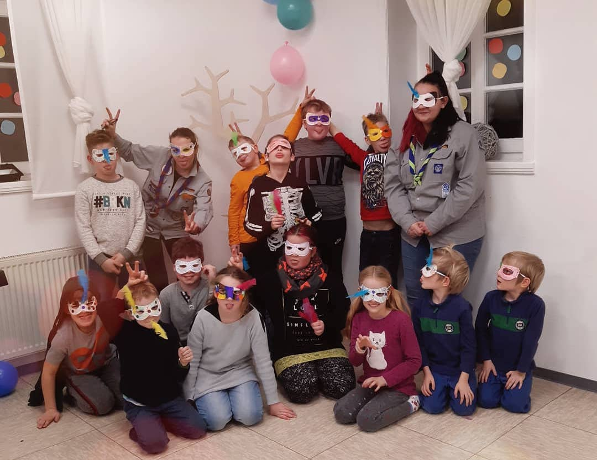
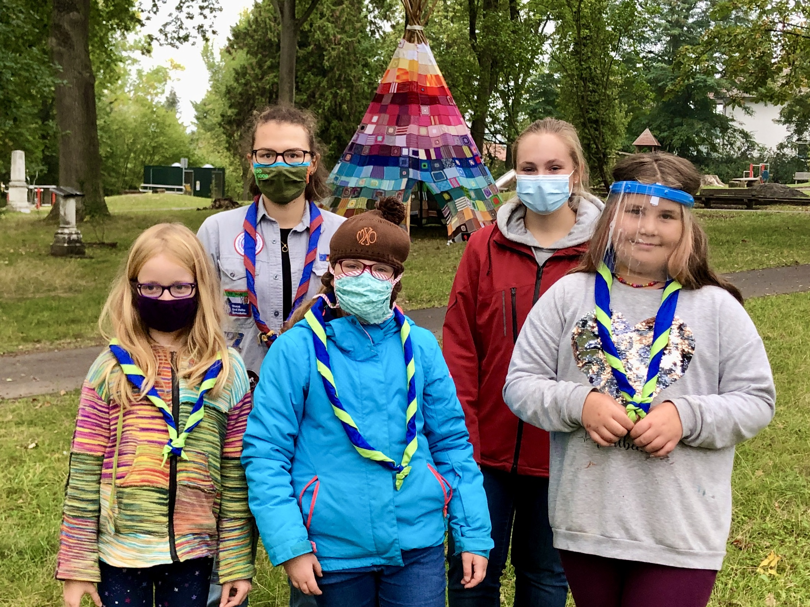
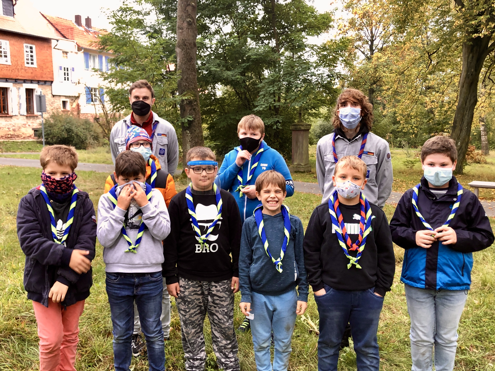
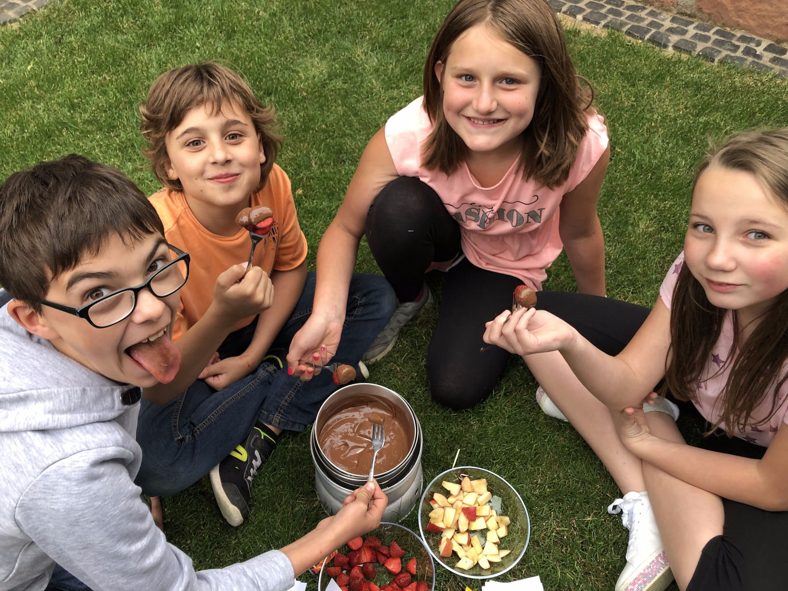

##### Wölflinge 

- Alter: 7 bis 10 Jahre (Jahrgänge {{ 'now' | date: "%Y" | minus: 10 }} - {{ 'now' | date: "%Y" | minus: 7 }})
- Gruppenleiterin: Lisa Semler [&#9993;](mailto:lisa@vcp-kirchhain.de) & Vanessa Tomzik
<!-- - Mittwochs, 17:00 - 18:00 Uhr -->
- Stufe: Kinderstufe

<!---->

##### Sippe Luchse

- Mädchen, Alter: {{ 'now' | date: "%Y" | minus: 2011 }} bis {{ 'now' | date: "%Y" | minus: 2009 }} Jahre (Jahrgänge 2009 - 2011)
- Gruppenleiterin: Lisa Semler [&#9993;](mailto:lisa@vcp-kirchhain.de)
<!-- - Mittwochs, 18:15 - 19:15 Uhr -->
- Stufe: Jungpfadfinder*innen

<!---->

##### Sippe (neu Herbst 2020)

- Jungs, Alter: {{ 'now' | date: "%Y" | minus: 2010 }} bis {{ 'now' | date: "%Y" | minus: 2008 }} Jahre (Jahrgänge 2008 - 2010)
- Gruppenleiter: Christian Ehrhardt [&#9993;](mailto:christian@vcp-kirchhain.de)
- Montags, 17:00 - 18:30 Uhr
- Stufe: Jungpfadfinder*innen

<!---->

##### Sippe Wölfe

- Alter: {{ 'now' | date: "%Y" | minus: 2008 }} bis {{ 'now' | date: "%Y" | minus: 2007 }} Jahre (Jahrgänge 2007 - 2008)
- Gruppenleiter: Jonas Höchst [&#9993;](mailto:jonas@vcp-kirchhain.de)
- Donnerstags, 18:00 - 19:30 Uhr
- Stufe: Jungpfadfinder*innen

<!---->

##### Sippe Faultiere

- Alter: {{ 'now' | date: "%Y" | minus: 2007 }} bis {{ 'now' | date: "%Y" | minus: 2006 }} Jahre (Jahrgänge 2006 - 2007)
- Gruppenleiter: Robin Günkel [&#9993;](mailto:robin@vcp-kirchhain.de)
- Mittwochs, 18:00 - 19:30 Uhr
- Stufe: Jungpfadfinder*innen

### Hast du auch Lust, Pfade zu finden?

Alle unsere Gruppen sind noch offen für neue Pfadfinder\*innen. Auch wenn ihr nicht in unserer Kirchengemeinde seid, einer anderen Konfession oder Religion angehört, könnt ihr einfach dazukommen.

Bei Fragen euch auch mit einer kurzen Mail an die Gruppenleiter\*in oder an [hallo@vcp-kirchhain.de](mailto:hallo@vcp-kirchhain.de) wenden.
