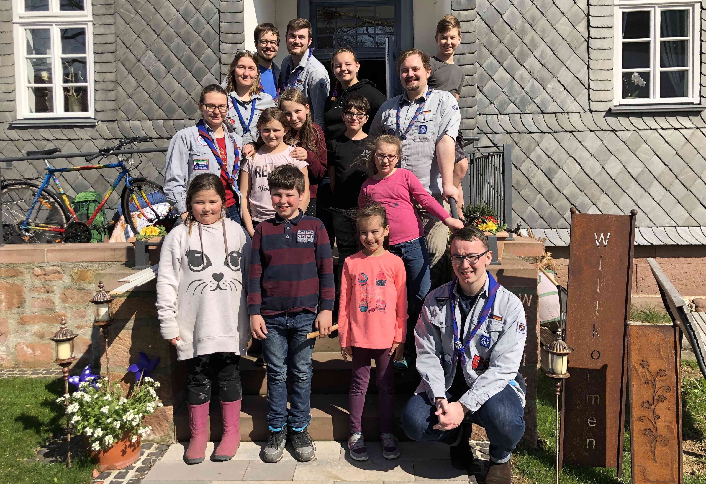
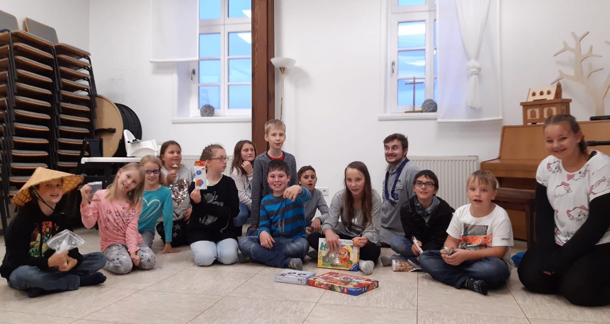
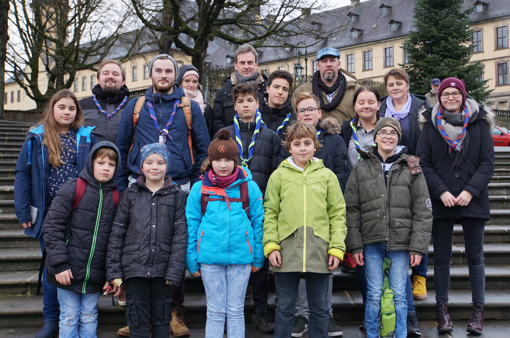

Der VCP Kirchhain ist ein Pfadfinderstamm-Neuanfang in [Kirchhain](https://www.kirchhain.de) vom [Verband Christlicher Pfadfinderinnen und Pfadfinder](https://www.vcp.de). 

<!--
Gruppenbild von unserer ersten gemeinsamen Übernachtung im März 2019.-->

<!--
Gruppenbild aus einer gemeinsamen Gruppenstunde vor den Herbstferien 2019.-->

<!--
Gruppenbild von der Fahrt zum Friedenslichtgottesdienst in Fulda 2019.-->

Gruppenbild vom Sommerlager 2020 an der Lahn.

### Was machen Pfadfinder?

Pfadfinder - Kekse verkaufen, alten Omas über die Straße helfen, Wandern? 
Das und noch viel mehr machen wir, ab seht selbst...

    

    <iframe src='https://www.youtube.com/embed/n3-xTtaAODo' frameborder='0' allowfullscreen></iframe>

### Gruppenstunde

Unsere Gruppenstunden finden in der Schulzeit [an wechselnden Tagen](/gruppen/) in der alten Rektoratsschule (Pfarrhaus) an der Stadtkirche in Kirchhain statt. Wenn du Lust hast zu einer Gruppenstunde zu kommen, melde dich am besten kurz vorher bei uns, am besten an [hallo@vcp-kirchhain.de](mailto:hallo@vcp-kirchhain.de).

<iframe width="100%" height="500px" scrolling="no" marginheight="0" marginwidth="0" src="https://www.openstreetmap.org/export/embed.html?bbox=8.918100893497469%2C50.81960305817571%2C8.920651674270632%2C50.821392440642036&amp;layer=&amp;marker=50.82049775798012%2C8.919376283884048" style="border: 1px solid black"></iframe>

### Unser Ausrüster

[Freizeit und Fahrtenbedarf](https://www.fahrtenbedarf.de) (kurz: F&F) ist unser Ausrüster. Hier gibt es unsere Klufthemden, Messer, Becher und sogar Zelte. Die [kommentierte Packliste](/packliste/) ist mit Links zu F&F versehen und kann als Inspiration dienen, wenn Material angeschafft werden soll.
